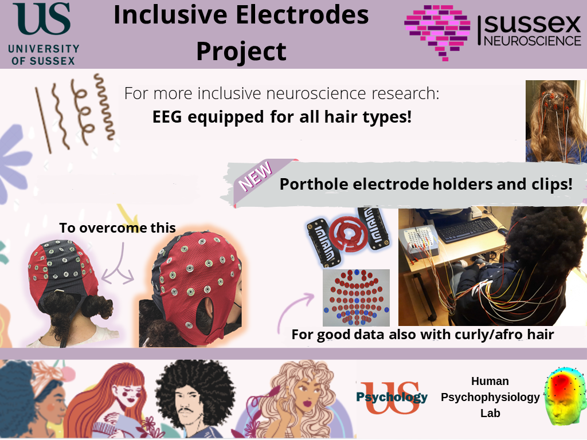

# inclusive-EEG-electrodes

EEG caps are not suitable for participants/patients with volumous, thick or curly hair, which creates bias in research data collection and hinders proper diagnostics.

The goal of this project is to design an inclusive system to hold EEG electrodes in place. That is, our holders will work equally well when applied to participants/patients with hair type.

Currently (05/2023) we have a working prototype that is made of 3D printed parts (printed in flexible TPU filament) and hair clips. 

All designs are freely available in this repository and shared under open source licenses. 

The final goal, under development is to have a "cap like system" where researchers and/or clinicians, particularly those with limited funds/resources will have a similar experience to current caps, while respecting that people have many different types of hair. A first prototype of the cap itself can be found [here](https://github.com/Sussex-Neuroscience/inclusive-eeg-cap)

This project has been developed by a number of people:

- Paloma Manguele
- Chris Racey
- Andre Maia Chagas
- Claudia Lawrence
- Benjamin Tribe

### electronic components
- Cup electrode:
- single connector:
- bayonet connector:
- cable harness connector: https://www.mouser.co.uk/ProductDetail/Hirose-Electric/FX2C-68S-127DSA71?qs=sGAEpiMZZMthaSLPVp%252B4asUKft4eOzg30%252BZzb3qsmrM%3D
- wires: 

